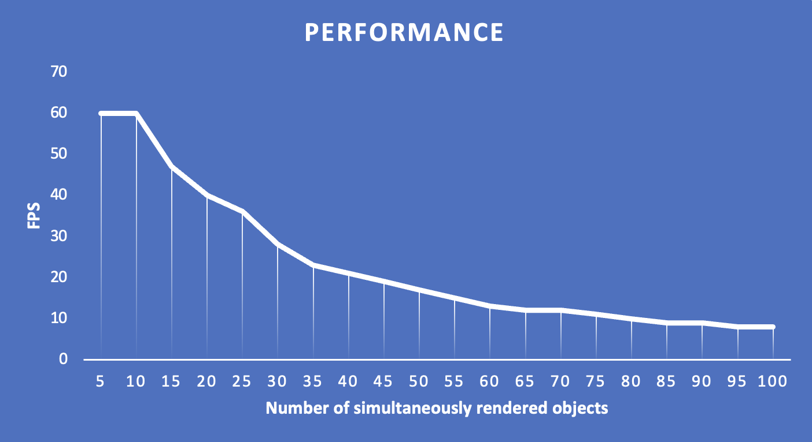

# Rusty Ache
Blazingly fast game engine written in Rust.

## How to run
Clone this repo:
```bash
  git clone git@github.com:p1onerka/rusty_ache.git
```
Open the project:
```bash
  cd rusty_ache
```
Run the project:
```bash
  cargo run --bin main
```

## Demo


## Docs
Project documentation is availible [here](https://p1onerka.github.io/rusty_ache/rusty_ache/index.html).

## Supported Platforms

This game engine project supports the following platforms:

- **Linux:** Officially tested on Ubuntu 24.04 and Fedora 42.
- **Windows:** Compatible with Windows 10 and 11.
- **macOS:** Tested on macOS.
- **kvadraOS:** Tested on kvadra Operating System.

- **Architectures:** Primarily x86_64, ARM64 support.

## System Requirements
- Rust stable toolchain (≥ 1.70.0)
- Graphics hardware supporting OpenGL 3.3+ or Vulkan 1.1+
- C compiler (`gcc`/`clang`) for building native dependencies
- ≥ 8GB RAM recommended

## Performance

Below is a graph showing the dependence of FPS on the number of simultaneously rendered objects, created under the following conditions:

- Setup: MacBook M1, 8Gb RAM
- Data: 113x113px object 
- Resolution: 200x200px



As shown on the graph, the engine’s performance is above 20 FPS with <=40 objects. It is strongly discouraged to add more than this number of objects with a size similar to 113x113px on a range smaller than resolution parameters.

## Devs
- [Aleksei Dmitrievstev](https://github.com/admitrievtsev)
- [Ksenia Kotelnikova](https://github.com/p1onerka)
- [Sofya Kozyreva](https://github.com/sofyak0zyreva)
- [Kostya Oreshin](https://github.com/sevenbunu)